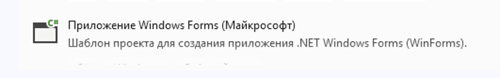
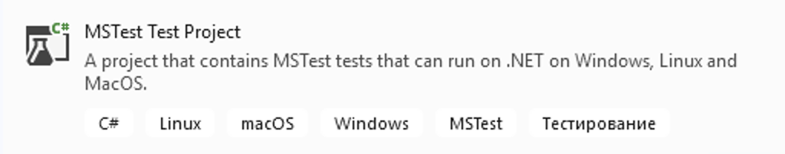

# ST-9 Тестирование GUI-приложений с использованием C# и фрейморка Selenium


Срок выполнения задания:

**по 31.05.2025** 

## Подготовка к выполнению работы

- скачать [Windows Application Driver ](https://github.com/microsoft/WinAppDriver/releases/tag/v1.2.1)
- установить в **Microsoft Visual Studio** поддержку языка C# и поддержку проектов для тестирования **MS Test**




## Задание №1

Создать проект **WinForms** "гостиничный калькулятор" с простейшей формой:


Идея программы: ввести данные в текстовые поля, нажать на кнопку "рассчитать" и получить итоговую сумму.

Итоговая сумма зависит от указанного числа дней проживания, категории номера (люкс, стандарт, эконом), количества мест, а также дополнительных опций.


## Задание №2

Создать проект **MS Test** и в настройках указать следующие зависимости:

```xml
<ItemGroup>
  <PackageReference Include="Appium.WebDriver" Version="4.4.5" />
  <PackageReference Include="Microsoft.NET.Test.Sdk" Version="17.11.1" />
  <PackageReference Include="MSTest" Version="3.6.1" />
  <PackageReference Include="Selenium.Support" Version="3.141.0" />
  <PackageReference Include="Selenium.WebDriver" Version="3.141.0" />
</ItemGroup>
```

Стоит обратить внимание на версии **Selenium** и **Appium**! Версии остальных пакетов могут быть другие.

## Задание №3

Написать несколько однотипных тестов для исследования работы гостиничного калькулятора (правильности рассчетов)

В классе тестов нужно объявить несколько полей и подготовительные методы:

```csharp
public class Tests
    {
        public const string DriveURL = "http://127.0.0.1:4723/";
        public WindowsDriver<WindowsElement> driver;

        [SetUp]
        public void Setup()
        {
            var appCapabilities = new AppiumOptions();
            appCapabilities.AddAdditionalCapability("app", @"C:\Users\Администратор\source\repos\WinFormsAppium-2\WinFormsAppium-2\bin\Debug\net8.0-windows\WinFormsAppium-2.exe");
            appCapabilities.AddAdditionalCapability("ms:waitForAppLaunch", "5");
            appCapabilities.AddAdditionalCapability("deviceName", "WindowsPC");

            driver = new WindowsDriver<WindowsElement>(new Uri(DriveURL), appCapabilities);
        }
```

Свойство **app** должно содержать корректный путь к исполняемому файлу гостиничного калькулятора!


Далее, помещаются тестовые методы:

```csharp
        [TestMethod]
        public void TestMethod1()
        {
          ...
        }
```

В качестве примера обращения к форме (калькулятора) приводит фрагмент кода теста:

```csharp
...
var tbX = driver.FindElementByAccessibilityId("tbX");
tbX.SendKeys("123");
var tbY = driver.FindElementByAccessibilityId("tbY");
tbY.SendKeys("100");
var btnSum = driver.FindElementByAccessibilityId("btnSum");
btnSum.Click();
var tbZ = driver.FindElementByAccessibilityId("tbZ");
Assert.AreEqual(tbZ.Text, "223");
...
```

Количество тестов должно быть не менее 5.

## Задание №4

- Запустить в консоли **Windows Application Driver**. Возможно, в некоторых версиях Windows нужно будет включить режим разработчика
- Построить приложение, открыть **Обозреватель тестов** и запустить тесты
- Тесты должны запустить калькулятор и проверить его работу

## Состав проекта

- Файл `src/Form1.cs` - код гостиничного калькулятора (обработчики событий формы)
- Файл `src/Test1.cs` - код тестов
- Файл `result/screen-1.png` - скриншот заполненной формы (с данными)
- Файл `result/screen-2.png` - скриншот обозревателя тестов с отметками о выполнении всех тестов

